# 🌿 Middle East ESG & Clean Energy Analytics Dashboard

> **A full-stack data engineering and ML portfolio project** — tracking sovereign and corporate clean energy investment across 8 Middle Eastern nations from 2015 to 2024, with Prophet-powered forecasts through 2030.


---

## 🌐 Live Demo

| Service | URL |
|---|---|
| React Dashboard | https://me-esg-clean-energy-dashboard.vercel.app/ |
| FastAPI + Swagger | https://me-esg-clean-energy-dashboard.onrender.com/ |
| Streamlit EDA | https://younes-nader-esg-dashboard.streamlit.app/ |

---

## About

The Middle East is simultaneously the world's largest hydrocarbon exporter and one of the regions most acutely exposed to climate change — temperatures projected to rise 2–4°C above the global mean by 2050 threaten water security, habitability, and agricultural viability across the Gulf, Levant, and North Africa. This tension has triggered a structural policy shift: sovereign wealth funds including Saudi Arabia's Public Investment Fund (>$700B AUM), Abu Dhabi's Mubadala, and the Qatar Investment Authority have committed hundreds of billions to clean energy transition. National visions — **Saudi Vision 2030**, **UAE Net Zero 2050**, **Qatar National Vision 2030** — have embedded ESG targets into state planning at the highest level.

This project builds a complete, end-to-end data engineering and analytics system to track that transition. It covers the full stack: synthetic data generation calibrated to real-world magnitudes, a Python cleaning and feature-engineering pipeline, Ridge Regression and Random Forest models for ESG budget prediction, Facebook Prophet for per-country time-series forecasting, a FastAPI REST backend with 11 endpoints, a React dashboard with Recharts visualisations, and a Streamlit analytical notebook — all containerised with Docker and ready to deploy.

---

## Screenshots

### Overview
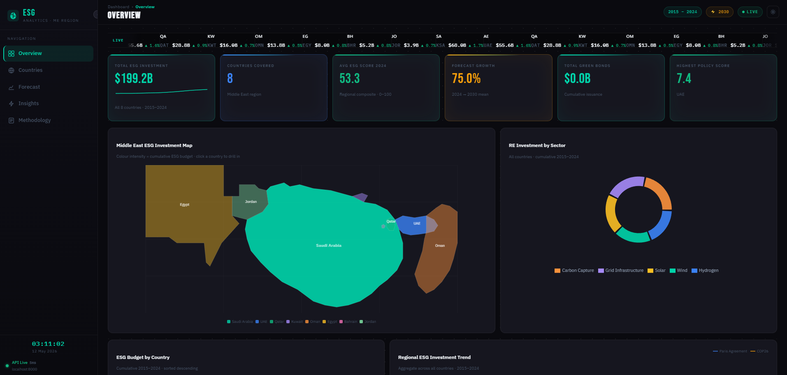
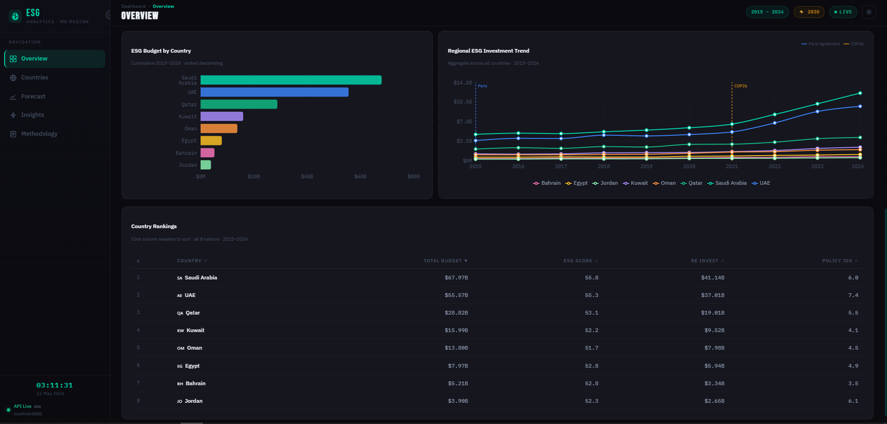

### Countries
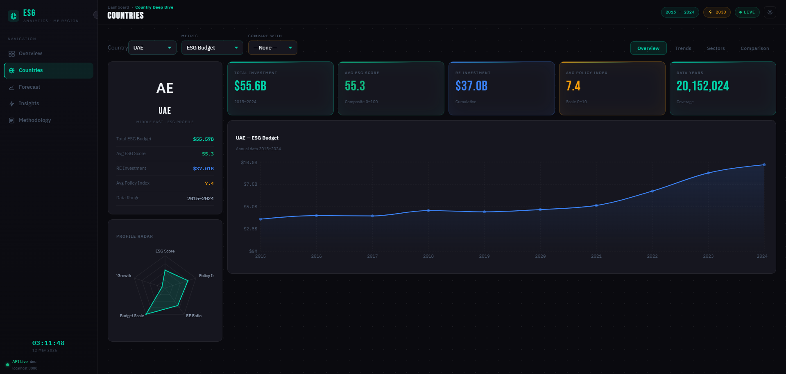
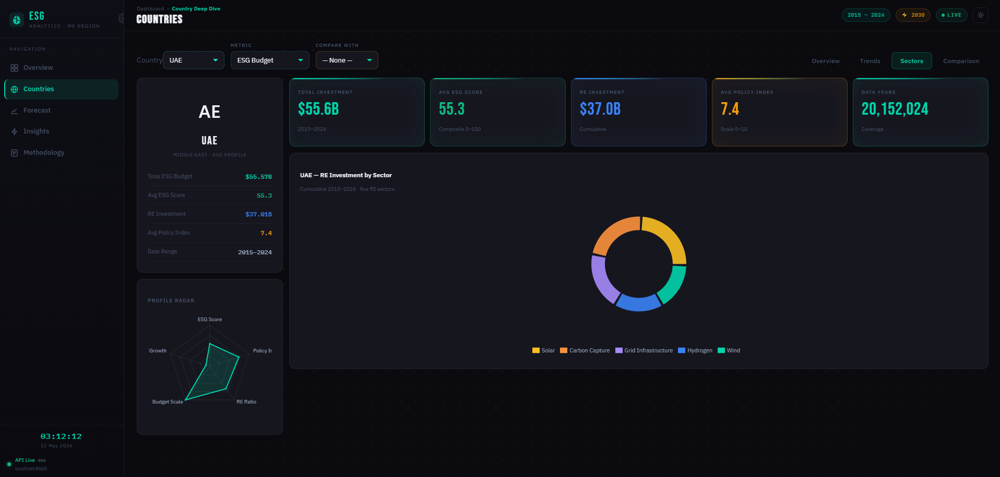
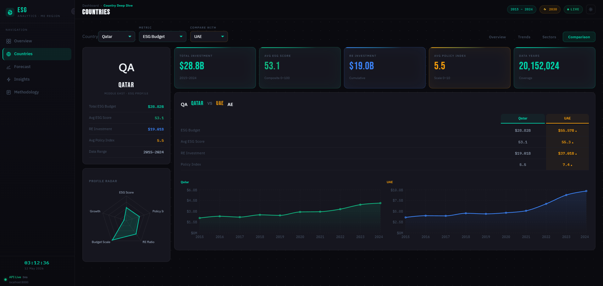

### Forecasting
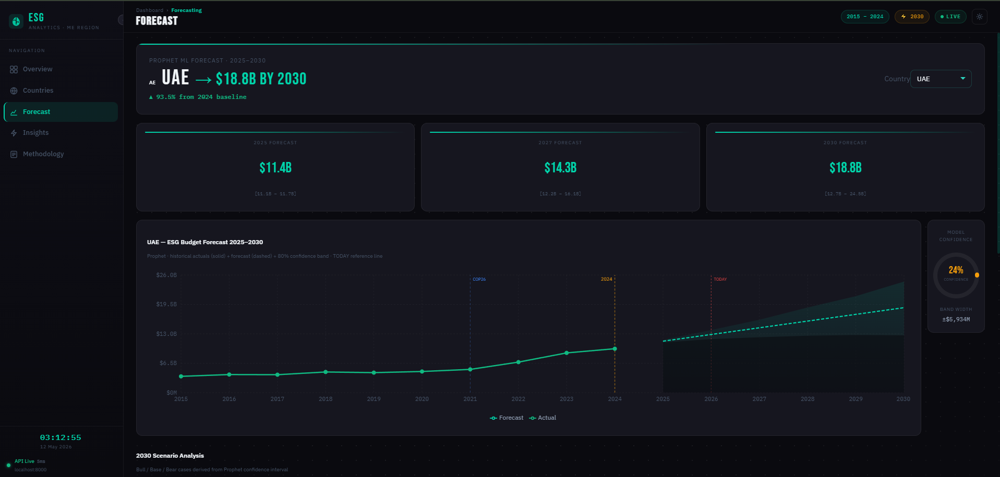
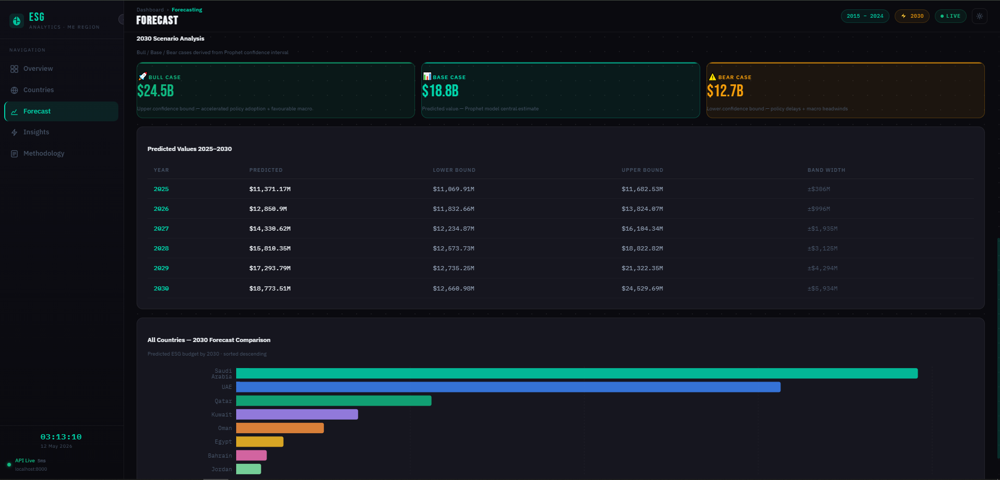

### Insights
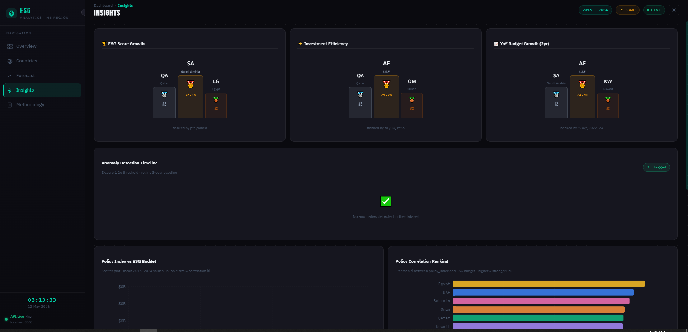
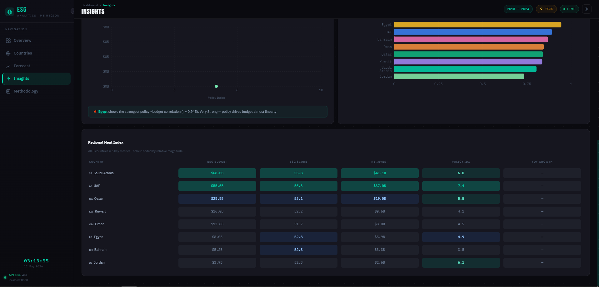

### Methodology
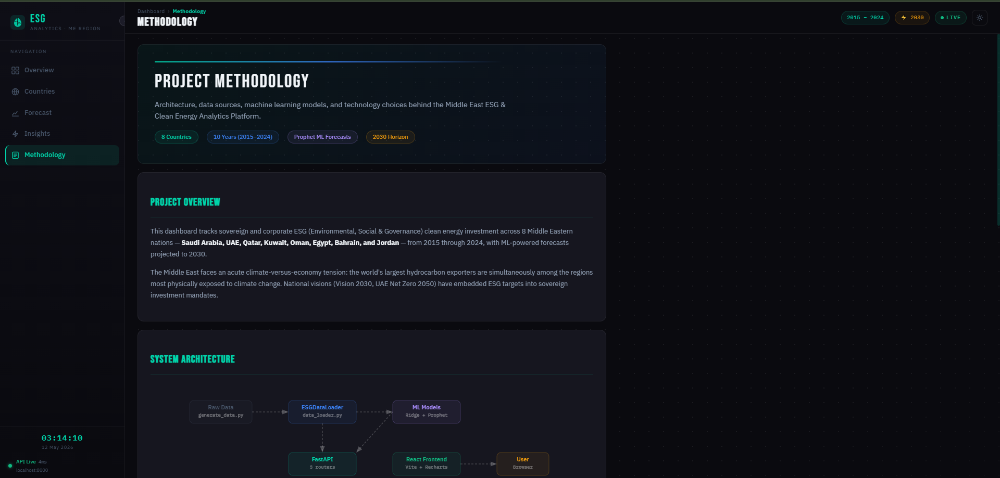
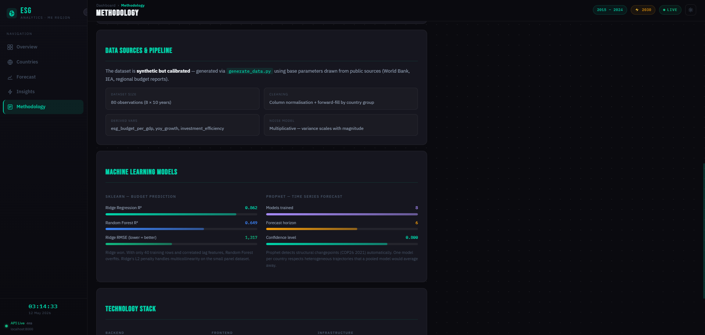
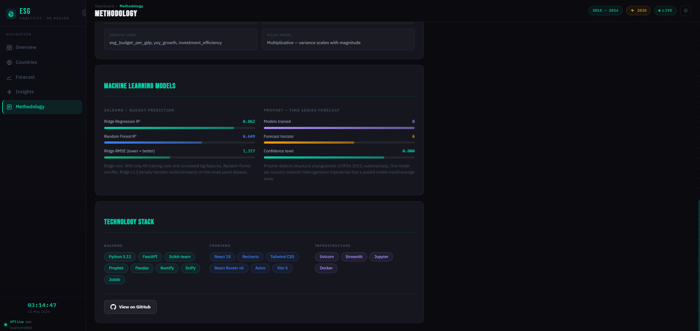

---

## Features

- 🗂️ **Synthetic but calibrated dataset** — 80 annual observations across 8 ME countries (2015–2024), generated with country-specific base parameters, multiplicative noise, and realistic post-COP26 acceleration effects
- 🧹 **Automated data pipeline** — `ESGDataLoader` normalises columns, forward-fills gaps within country groups, and engineers three derived features (`esg_budget_per_gdp`, `yoy_growth`, `investment_efficiency`)
- 🤖 **Dual ML models** — Ridge Regression (winner, R² = 0.862) and Random Forest trained on a strict temporal split; feature importances surfaced for explainability
- 🔮 **Per-country Prophet forecasts** — 8 independent models with GDP, Policy Index, and Oil Revenue regressors; 80% credible intervals; 2025–2030 horizon
- ⚡ **FastAPI REST backend** — 11 endpoints across `/api/data`, `/api/forecast`, and `/api/insights`; startup pre-loading; Pydantic response models; Swagger UI at `/docs`
- 📊 **React dashboard** — 5-page SPA (React 18 + React Router + Recharts); count-up KPI animations; skeleton loaders; custom SVG heatmap; ForecastChart confidence band
- 🌿 **Streamlit EDA notebook** — 7-section exploratory analysis with animated Plotly scatters, a terminal-cartography dark theme, and 11 auto-exported PNG figures
- 🐳 **Docker-first deployment** — multi-stage React build, nginx SPA routing, healthchecked `docker-compose` with a single `docker-compose up --build` quickstart

---

## Tech Stack

| Layer | Tools |
|---|---|
| **Data & ML** | Python 3.11 · Pandas · NumPy · Scikit-learn · Prophet (Meta) · SciPy · Joblib |
| **API Backend** | FastAPI · Uvicorn · Pydantic v2 |
| **React Frontend** | React 18 · React Router v6 · Recharts · Tailwind CSS · Axios · Vite |
| **Streamlit Dashboard** | Streamlit 1.35 · Plotly · Matplotlib · Seaborn |
| **DevOps** | Docker · Docker Compose · nginx (alpine) · multi-stage builds |
| **Dev Tools** | pytest · black · Jupyter |

---

## Architecture

```
┌─────────────────────────────────────────────────────────────────────┐
│                          DATA LAYER                                  │
│   generate_data.py  →  me_esg_data.csv  →  ESGDataLoader            │
│   (synthetic, calibrated)                  (clean + feature eng.)   │
└──────────────────────────────┬──────────────────────────────────────┘
                               │
┌──────────────────────────────▼──────────────────────────────────────┐
│                       PYTHON ML PIPELINE                             │
│   ModelTrainer                     Forecaster                        │
│   ├── Feature engineering          ├── 8× Prophet models             │
│   ├── Ridge Regression (winner)    ├── External regressors           │
│   ├── Random Forest                ├── Credible intervals            │
│   └── Temporal train/test split    └── forecasts.csv                 │
│                                                                      │
│   model_report.json ← metrics · feature importances · prophet status│
└──────────────────────────────┬──────────────────────────────────────┘
                               │
┌──────────────────────────────▼──────────────────────────────────────┐
│                         FASTAPI BACKEND                              │
│   /api/data        /api/forecast        /api/insights                │
│   ├── /countries   ├── /{country}       ├── /top-performers          │
│   ├── /overview    ├── /compare         ├── /anomalies               │
│   ├── /timeseries  └── /model-info      └── /policy-impact           │
│   ├── /heatmap                                                        │
│   └── /sectors            → Pydantic schemas · in-memory app.state   │
└──────────────┬───────────────────────────────────────────────────────┘
               │
       ┌───────┴────────┐
       │                │
┌──────▼──────┐  ┌──────▼──────────────────────────────────────────┐
│   REACT     │  │              STREAMLIT EDA                        │
│  DASHBOARD  │  │  7 sections · Plotly interactive charts           │
│             │  │  Animated scatter · Correlation heatmap           │
│  5 pages    │  │  11 auto-exported PNG figures                     │
│  Recharts   │  │  Terminal-cartography dark theme                  │
│  nginx      │  └─────────────────────────────────────────────────┘
└─────────────┘
```

---

## Quick Start

### Option A — Docker (recommended, 2 commands)

```bash
# 1. Clone and enter the project
git clone https://github.com/younesnader/me-esg-dashboard.git
cd me-esg-dashboard

# 2. Build and start all services
docker-compose up --build
```

Services will be available at:
- **React Dashboard** → http://localhost:3000
- **FastAPI + Swagger** → http://localhost:8000/docs
- **ReDoc** → http://localhost:8000/redoc

> **Note:** The first build takes ~3–5 minutes while Prophet and its dependencies compile. Subsequent starts use the Docker layer cache and launch in seconds.

---

### Option B — Manual (local development)

**Prerequisites:** Python 3.11+, Node.js 18+, npm

#### 1 — Backend

```bash
# Create and activate virtual environment
python -m venv venv
source venv/bin/activate          # Windows: venv\Scripts\activate

# Install Python dependencies
pip install -r requirements.txt

# Generate the synthetic dataset
python generate_data.py           # → data/raw/me_esg_data.csv

# Run the ML pipeline (trains models + generates forecasts)
python backend/models/generate_report.py

# Start the FastAPI server
uvicorn backend.main:app --reload --port 8000
```

#### 2 — React Frontend (new terminal)

```bash
cd frontend
npm install
npm run dev                        # → http://localhost:3000
```

#### 3 — Streamlit Dashboard (optional, new terminal)

```bash
streamlit run streamlit_app/app.py # → http://localhost:8501
```

---

## API Documentation

| Method | Endpoint | Description |
|---|---|---|
| `GET` | `/` | API info + all registered routes |
| `GET` | `/api/data/countries` | List of 8 countries |
| `GET` | `/api/data/overview` | KPI aggregates per country + sector mix (optional `?country=UAE`) |
| `GET` | `/api/data/timeseries` | Annual time series for any metric (`?metric=esg_budget&country=Qatar`) |
| `GET` | `/api/data/heatmap` | Pearson correlation matrix as nested JSON |
| `GET` | `/api/data/sectors` | RE investment totals by sector |
| `GET` | `/api/forecast/{country}` | Historical actuals + Prophet 2025–2030 for one country |
| `GET` | `/api/forecast/compare` | All countries' 2030 predictions with % change from 2024 |
| `GET` | `/api/forecast/model-info` | RMSE, MAE, R² + Random Forest feature importances |
| `GET` | `/api/insights/top-performers` | Top 3 countries across 3 performance dimensions |
| `GET` | `/api/insights/anomalies` | 2σ rolling z-score anomaly detection |
| `GET` | `/api/insights/policy-impact` | OLS regression: policy_index → ESG budget per country |

**Interactive docs:** http://localhost:8000/docs (Swagger UI) · http://localhost:8000/redoc (ReDoc)

**Metric choices for `/api/data/timeseries`:** `esg_budget` · `renewable_investment` · `esg_score` · `carbon_emissions` · `green_bonds`

---

## Dataset

The dataset is **synthetic but calibrated** to real-world orders of magnitude using public sources (World Bank, IEA, regional national budgets). It covers **8 countries × 10 years = 80 annual observations**, with these key columns:

| Column | Description |
|---|---|
| `esg_budget_usd_million` | Total ESG-related government/corporate budget (USD M) |
| `renewable_energy_investment_usd_million` | Clean energy capital deployed (USD M) |
| `solar_capacity_mw` / `wind_capacity_mw` | Installed capacity (MW) |
| `carbon_emissions_mt` | CO₂-equivalent emissions (metric tons, millions) |
| `esg_score` | Composite ESG score 0–100 |
| `gdp_usd_billion` | Nominal GDP (USD billion) |
| `policy_index` | Regulatory clean energy policy strength (0–10) |
| `green_bonds_issued_usd_million` | Sovereign/corporate green bond issuances (USD M) |
| `sector` | Solar · Wind · Hydrogen · Grid Infrastructure · Carbon Capture |
| `esg_budget_per_gdp` | ESG budget as % of GDP (derived) |
| `yoy_growth` | Year-over-year % change in ESG budget (derived) |
| `investment_efficiency` | Renewable investment ÷ carbon emissions (derived) |

**Countries covered:** Saudi Arabia, UAE, Qatar, Kuwait, Oman, Bahrain, Jordan, Egypt

**Key data events modelled:** Paris Agreement baseline (2015), COP26 acceleration (2021), UAE Net Zero announcement (2021), Saudi Vision 2030 milestones.

---

## ML Models

### Ridge Regression (Budget Prediction)

Trained on 2015–2021, evaluated on the held-out 2022–2024 period. Five engineered features — including lag columns and a policy×GDP interaction term — are computed within country groups to prevent data leakage.

| Model | RMSE (USD M) | MAE (USD M) | R² | Result |
|---|---|---|---|---|
| **Ridge Regression** | ~1,317 | ~822 | 0.862 | ✅ Winner |
| Random Forest | ~2,099 | ~1,192 | 0.649 | |

Ridge wins because with only 40 training rows and correlated lag features, the Random Forest overfits. Ridge's L2 penalty handles the multicollinearity cleanly.

### Facebook Prophet (Forecasting)

Eight independent models — one per country — with GDP, Policy Index, and Oil Revenue as external regressors. Prophet's automatic changepoint detection captures the COP26 structural break without manual intervention. Forecasts cover 2025–2030 with 80% credible intervals.

---

## Project Structure

```
me-esg-dashboard/
│
├── 📄 docker-compose.yml          # Orchestrate api + frontend services
├── 📄 .gitignore
├── 📄 README.md
│
├── 📂 backend/
│   ├── Dockerfile
│   ├── main.py                    # FastAPI app factory + lifespan startup
│   ├── schemas.py                 # All Pydantic response models
│   ├── routers/
│   │   ├── data_router.py         # /api/data endpoints
│   │   ├── forecast_router.py     # /api/forecast endpoints
│   │   └── insights_router.py     # /api/insights endpoints
│   ├── models/
│   │   ├── model_trainer.py       # Ridge + Random Forest pipeline
│   │   ├── forecaster.py          # Prophet per-country models
│   │   ├── generate_report.py     # Orchestration entry point
│   │   └── saved_models/          # joblib artefacts (gitignored)
│   └── utils/
│       └── data_loader.py         # ESGDataLoader class
│
├── 📂 frontend/
│   ├── Dockerfile                 # Multi-stage Node → nginx build
│   ├── nginx.conf                 # SPA routing + API proxy
│   ├── index.html
│   ├── package.json
│   ├── vite.config.js
│   ├── tailwind.config.js
│   └── src/
│       ├── App.jsx
│       ├── main.jsx
│       ├── index.css              # Design tokens + skeleton animations
│       ├── api/
│       │   └── apiClient.js       # Centralised axios calls (11 endpoints)
│       ├── components/
│       │   ├── Layout/
│       │   │   ├── Sidebar.jsx    # Nav + live API status dot
│       │   │   └── TopBar.jsx
│       │   ├── Charts/
│       │   │   ├── TimeseriesChart.jsx
│       │   │   ├── ForecastChart.jsx  # ComposedChart with confidence band
│       │   │   ├── SectorPieChart.jsx
│       │   │   ├── CountryBarChart.jsx
│       │   │   └── CorrelationHeatmap.jsx  # Hand-rolled SVG
│       │   └── UI/
│       │       ├── KPICard.jsx    # useCountUp hook + skeleton
│       │       └── CountrySelector.jsx
│       └── pages/
│           ├── Overview.jsx
│           ├── CountryView.jsx
│           ├── Forecast.jsx
│           ├── Insights.jsx
│           ├── Methodology.jsx
│           └── NotFound.jsx
│
├── 📂 streamlit_app/
│   ├── app.py                     # Entry point + sidebar nav
│   ├── utils.py                   # Palette, CSS, chart helpers
│   └── pages/
│       ├── overview.py
│       ├── country_deep_dive.py
│       ├── forecasting.py
│       ├── esg_analysis.py
│       └── about.py
│
├── 📂 notebooks/
│   ├── me_esg_eda.ipynb           # 7-section EDA notebook
│   └── figures/                   # Auto-exported PNG charts
│
├── 📂 data/
│   ├── raw/
│   │   └── me_esg_data.csv        # Synthetic raw dataset (gitignored)
│   └── processed/
│       ├── me_esg_clean.csv       # Cleaned + feature-engineered
│       ├── forecasts.csv          # Prophet 2025–2030 predictions
│       └── model_report.json      # Metrics + feature importances
│
├── 📄 generate_data.py            # Synthetic dataset generator
└── 📄 requirements.txt
```

---

## Contributing

Contributions, issues and feature requests are welcome. To contribute:

1. **Fork** the repository
2. Create a feature branch: `git checkout -b feature/my-new-feature`
3. Make your changes and write tests where appropriate
4. Run the linter: `black backend/` and `npm run lint` (if configured)
5. Commit with a clear message: `git commit -m 'feat: add XYZ chart to country view'`
6. Push to your fork: `git push origin feature/my-new-feature`
7. Open a **Pull Request** — describe the change and why it matters

### Areas for contribution
- Swap synthetic data for real IMF/World Bank API integration
- Add authentication to the FastAPI backend (JWT)
- Expand Prophet regressors with macro data from FRED / World Bank API
- Add a CI/CD pipeline (GitHub Actions) with pytest + Playwright E2E tests
- Improve accessibility (ARIA labels, keyboard navigation) in the React app

---

## License

This project is licensed under the **MIT License** — see the [LICENSE](LICENSE) file for details.

```
MIT License

Copyright (c) 2026 Younes Nader

Permission is hereby granted, free of charge, to any person obtaining a copy
of this software and associated documentation files (the "Software"), to deal
in the Software without restriction, including without limitation the rights
to use, copy, modify, merge, publish, distribute, sublicense, and/or sell
copies of the Software, and to permit persons to whom the Software is
furnished to do so, subject to the following conditions:

The above copyright notice and this permission notice shall be included in all
copies or substantial portions of the Software.
```

---

## Author

**Younes Nader**

Built as a portfolio project demonstrating end-to-end data engineering, machine learning, REST API design, and full-stack development skills.

[](https://www.linkedin.com/in/younesnader/)
[](https://github.com/YounesNader)

---

<div align="center">
  <sub>Built with 🌿 and a lot of Prophet confidence intervals</sub>
</div>
